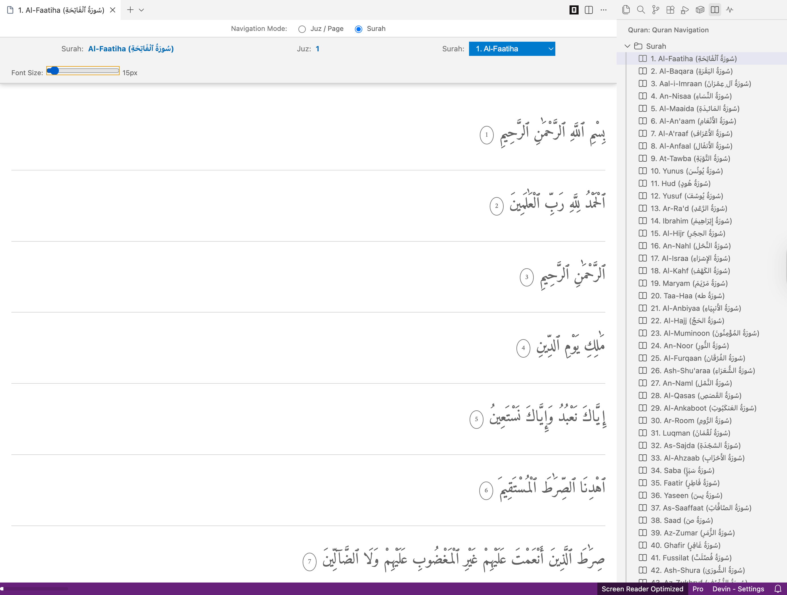

# Ini Quran

A lightweight, fully offline Quran reader for VS Code. Read the Holy Quran in authentic Uthmani script directly inside your editor — no internet connection, no translations, no distractions.

## Features

- **📖 Surah & Juz Navigation** — Browse all 114 Surahs and 30 Juz directly from the sidebar panel.
- **🔌 100% Offline** — Complete Quran data is embedded within the extension. Works without any internet connection.
- **🎨 Native VS Code Theming** — Seamlessly integrates with both Dark and Light themes.
- **🔤 Adjustable Font Size** — Customize Arabic text size on the fly via the toolbar slider.
- **⚡ Zero Dependencies** — Pure, self-contained extension with no external APIs or services.

## Installation

### From VS Code Marketplace

1. Open **Extensions** view (`Ctrl+Shift+X` / `Cmd+Shift+X`)
2. Search for **"Ini Quran"**
3. Click **Install**

### From VSIX (Manual)

1. Download the `.vsix` file from [Releases](https://github.com/emhaihsan/iniquran/releases)
2. In VS Code, open the Extensions view
3. Click the `...` menu → **Install from VSIX...**
4. Select the downloaded file

## Usage

1. Click the **Book (Quran)** icon in the Activity Bar (left sidebar)
2. Choose between **Surah** or **Juz** navigation mode
3. Click any Surah or Juz to open the reading view
4. Use the top toolbar to:
   - Switch between Surah and Page navigation
   - Adjust font size
   - Navigate to next/previous pages (in Juz mode)

## Requirements

- Visual Studio Code **1.80.0** or higher

## Extension Settings

This extension contributes the following settings:

| Setting | Default | Range | Description |
|---------|---------|-------|-------------|
| `iniquran.fontSize` | `18` | 12 - 64 | Font size for Quranic Arabic text |

## Data Source

Quran text (Uthmani script) is sourced from [Al Quran Cloud](https://alquran.cloud/api) and embedded locally within the extension for offline access.

## Changelog

See [CHANGELOG.md](CHANGELOG.md) for version history.

## License

This project is licensed under the [MIT License](LICENSE).
